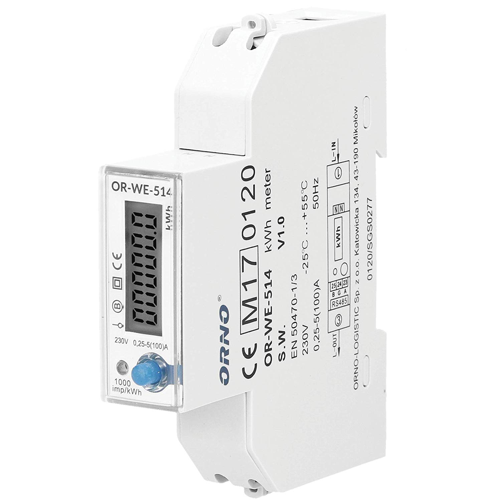

# orno-modbus-influxdb-grafana
Read ORNO OR-WE-514 ModbusRTU energy meter via RS485 serial and insert values to influxdb server and graph with grafana

The script reads the values every 10 seconds from the energy meter and insert them to the influxdb server. Read-out and publish takes about 1 second for all values @ 9600 Baud speed and 2-3 seconds @ 2400 Baud speed.
I've use the default serial config: 9600 Baud / 8E1.

# Parts List
- ORNO OR-WE-514 Modbus RTU Energy Meter (https://www.amazon.de/Orno-Wechselstromz%C3%A4hler-1-Phasen-Stromz%C3%A4hler-Zertifikat-Energieverbrauch/dp/B07Q1J1GJ4/ref=sr_1_1)

- USB-RS485 ch341-uart converter (https://www.makershop.de/module/kommunikation-module/rs485-adapter/)


# Dependencies
Python libraries
- io
- minimalmodbus
- serial
- struct
- time
- timeloop
- datetime
- os
- influxdb
- sys

# Intallation:
```
pip3 install io minimalmodbus serial influxdb time timeloop datetime
```
other:
- influxdb server
- Linux Platform (testet on Raspian Stretch)
copy the script to a location of your choice. I've chosen /opt/modbus-influxdb/.

```
cp modbus-influxdb.py /opt/modbus-influxdb/
```

# Starting the scipt
```
# change directory
cd /opt/modbus-influxdb/
# first make the script executable:
chmod +x modbus-influxdb.py
# executing:
./modbus-influxdb.py
```
